# DA34-final-Football_Agora_Web_Video

## Adios Team Final_Project (팀 프로젝트)

### Django 프레임워크

### 사용언어 및 라이브러리
- 언어: Python, Javascript
- 운영서버 라이브러리: [prod.txt](requirements/common.txt)
- 개발서버 라이브러리: [dev.txt](requirements/dev.txt)

### 웹 서비스 기능
1. 기본적인 웹페이지 기능: 
- **관련 앱 URL 정의**: [accounts앱](accounts/urls.py)
   1. 회원가입, 회원탈퇴, 로그인/로그아웃, 아이디/비밀번호 찾기, 비밀번호 초기화(이메일 인증) 후 변경
      

        
예시 화면

        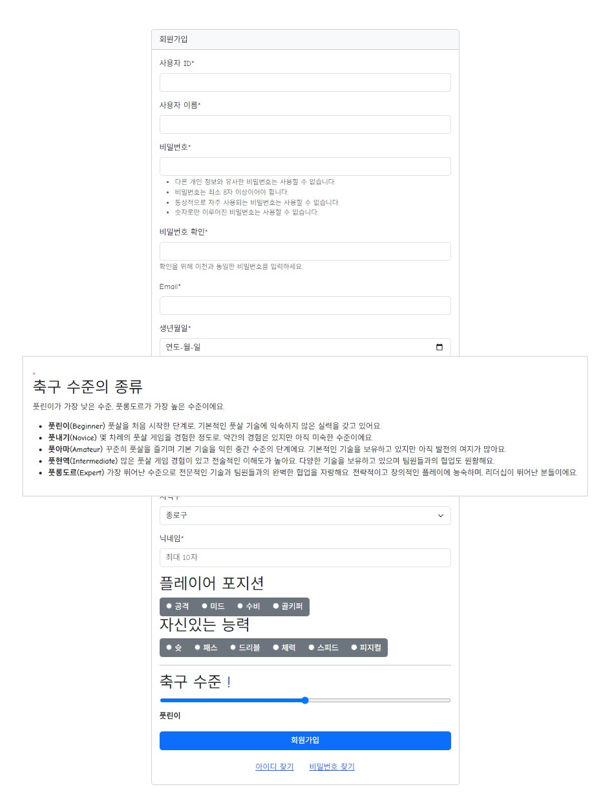
      

     
   2. 메인화면, 마이페이지
      

        
예시 화면

        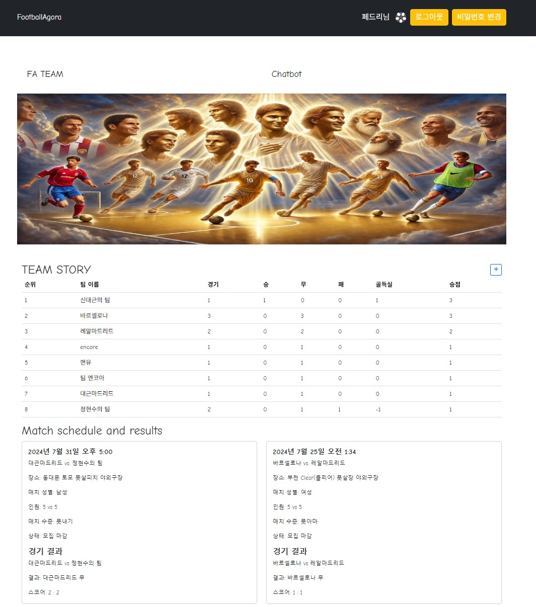
        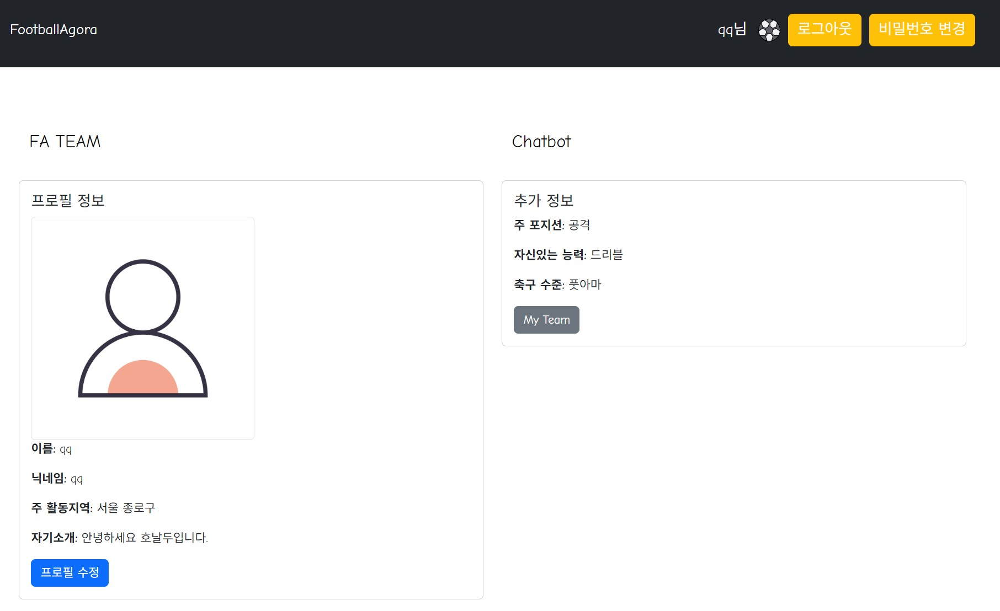
      

      
2. 풋살 매칭 플랫폼 마련:
- **관련 앱 URL 정의**: [team앱](team/urls.py)
  1. 팀 생성/가입/탈퇴/수정
     

       
예시 화면

       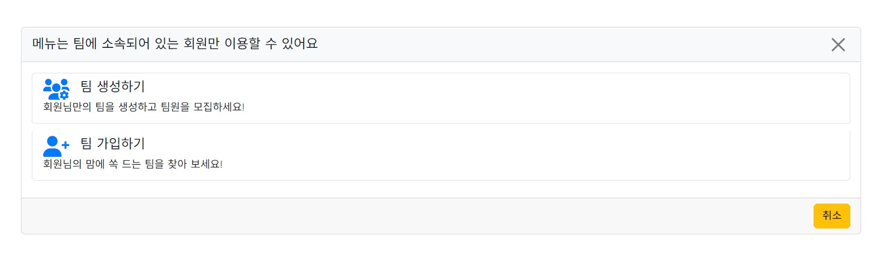
       
       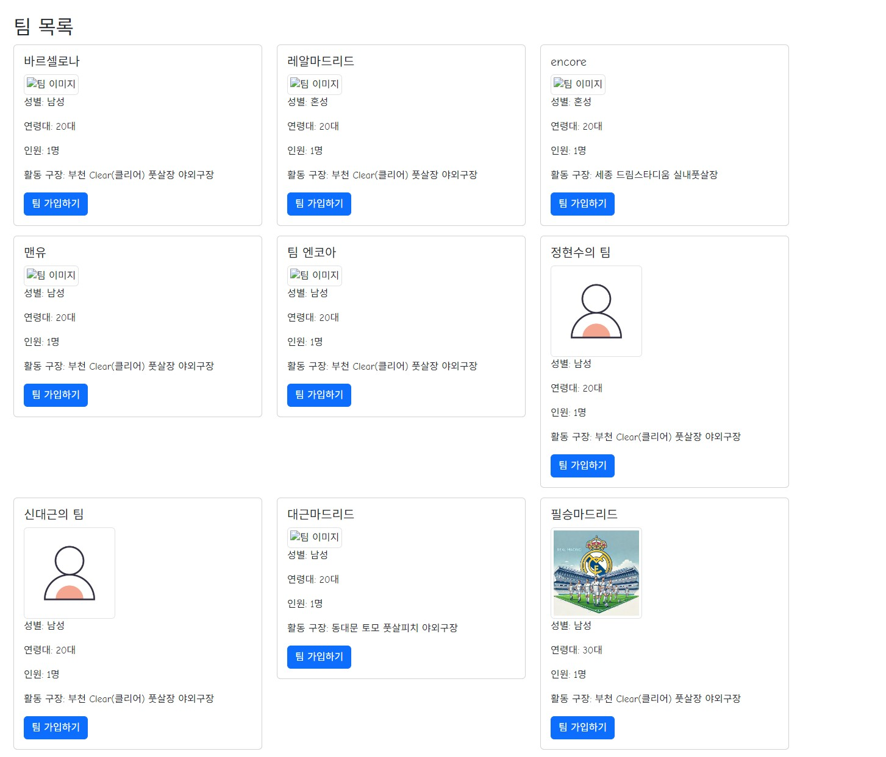
     

  2. 팀매칭(Team Match): 팀매칭을 위한 경기생성/참여
     

       
예시 화면

       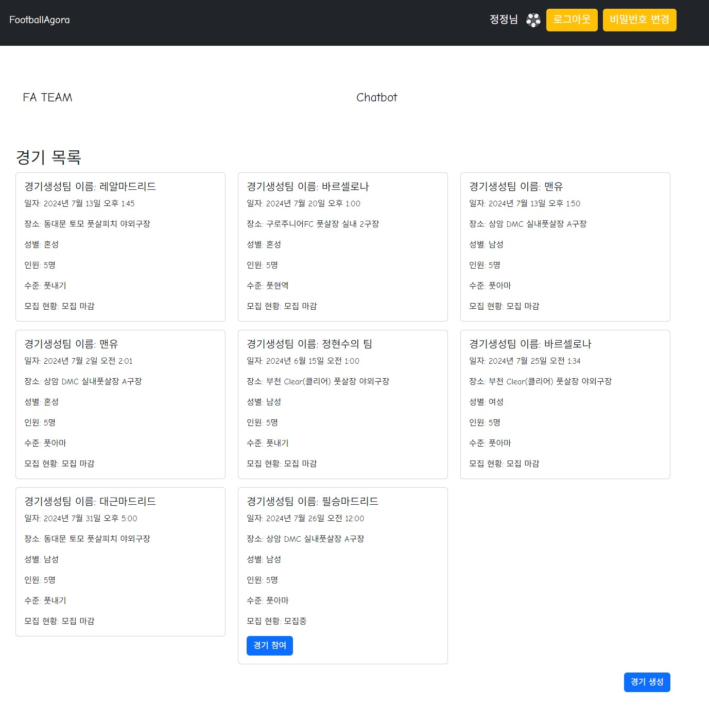
       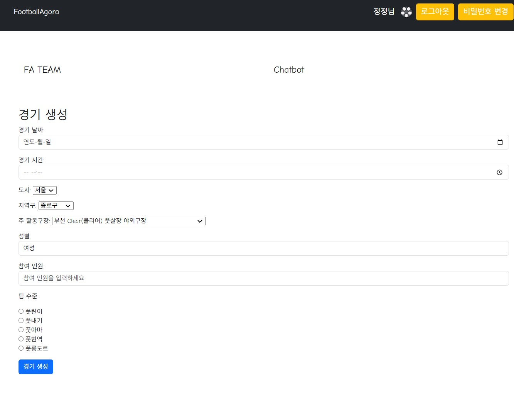
     

  3. 팀페이지(My Team): 팀 순위, 팀 경기일정
     

       
예시 화면

       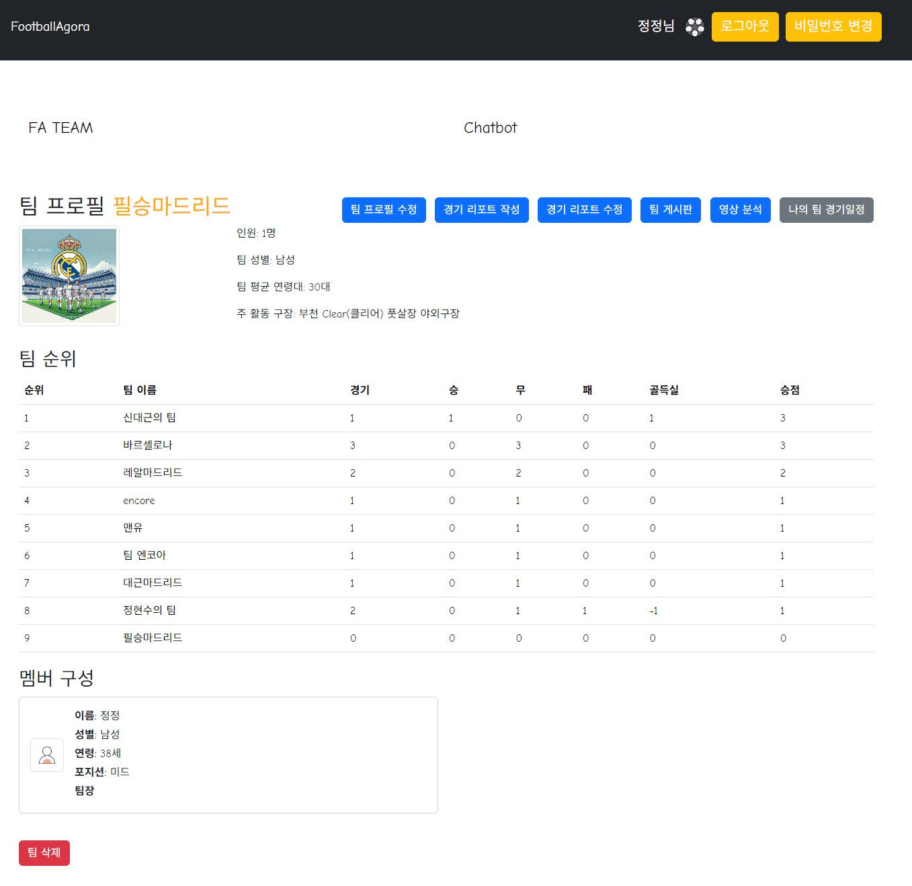
     

  4. 팀 경기 결과 작성: 경기리포트 작성/수정/삭제
     

       
예시 화면

       
     

  5. 매칭멤버 구하기: 팀 게시판 CRUD
     

       
예시 화면

       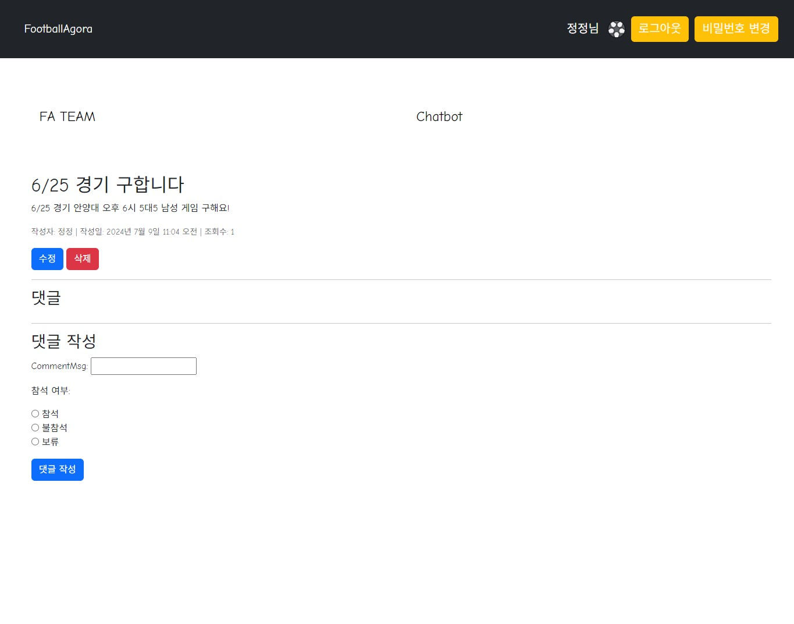
     

  6. 팀스토리(Team Story): FA 전체팀들의 순위, 경기일정
     

       
예시 화면

       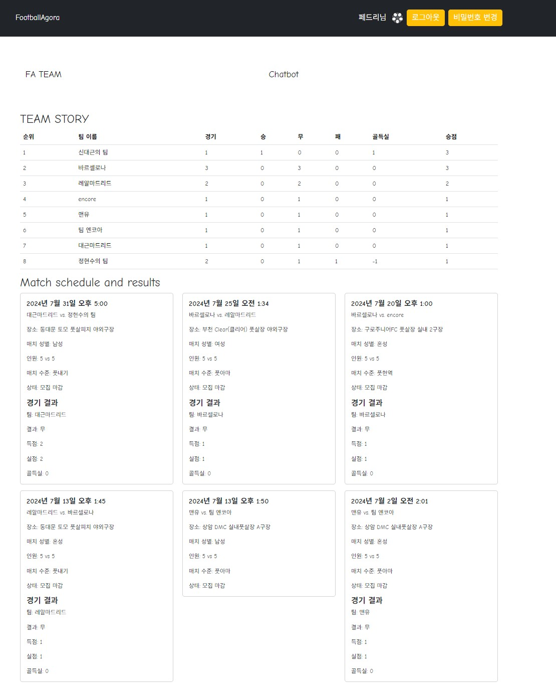
     

      
3. Chatbot을 이용한 풋살에 관한 접근성 향상
- **관련 앱 URL 정의**: [chatbot앱](chatbot/urls.py)
  1. FastApi를 이용한 모델 서빙 [모델서빙](chatbot/views.py)
     

       
예시 화면

       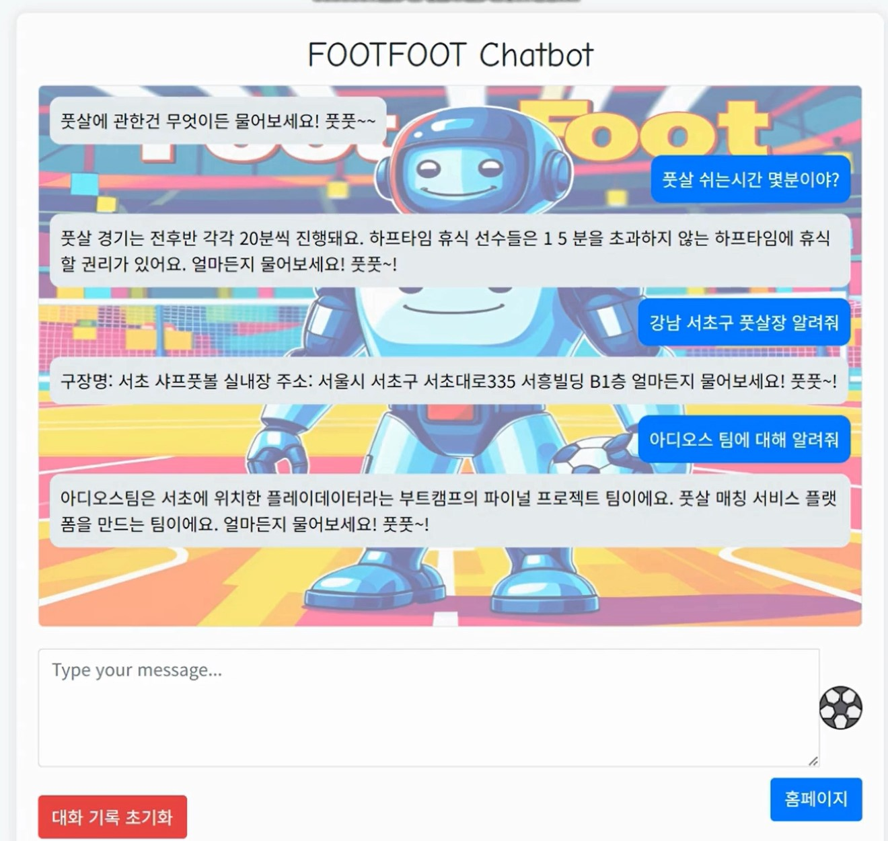
     

4. 경기 리포트에 올린 경기 동영상을 기반한 영상분석
   1. 장고내에 영상분석 모델 내장
      

          
예시 화면

          
      

  
