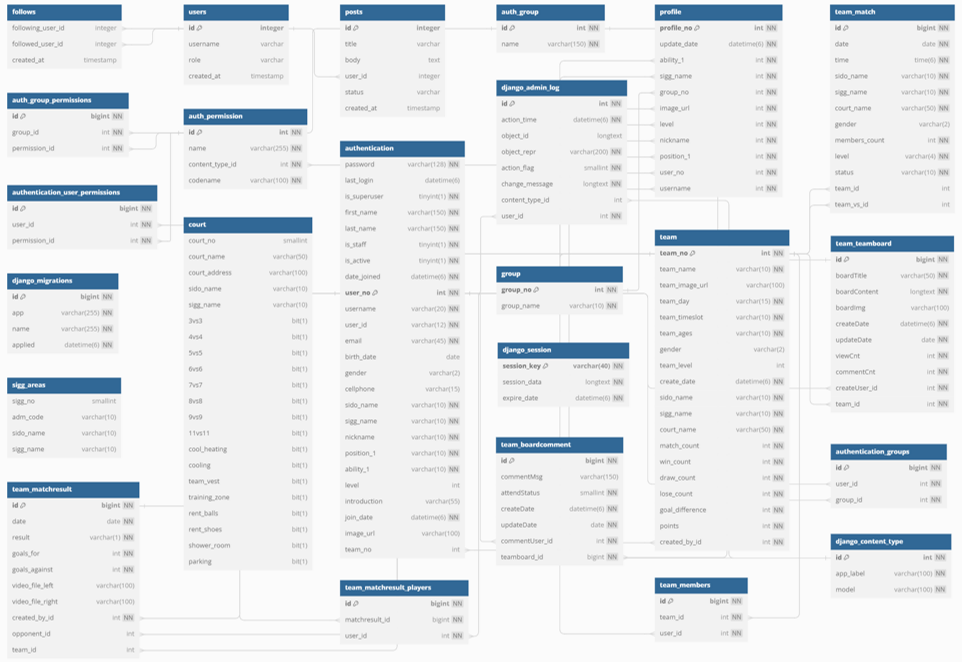
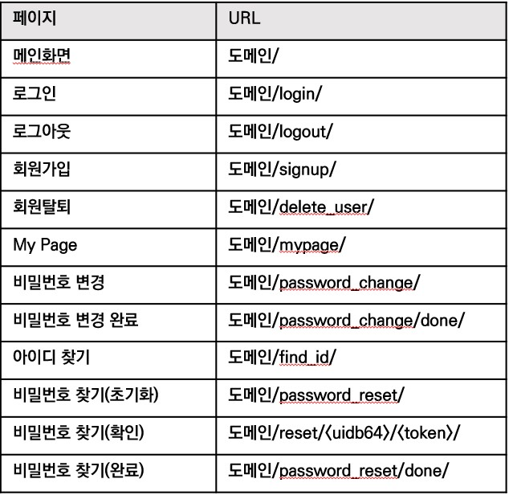
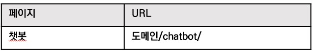
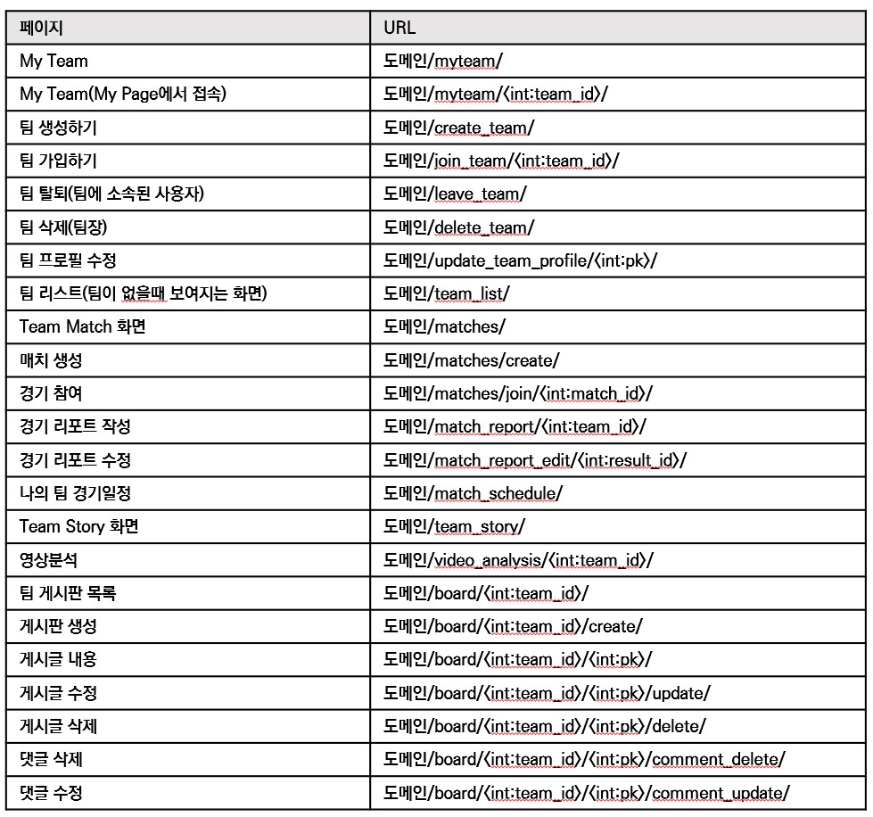
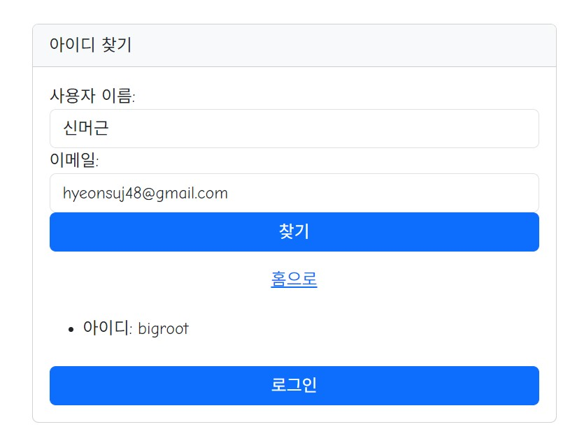
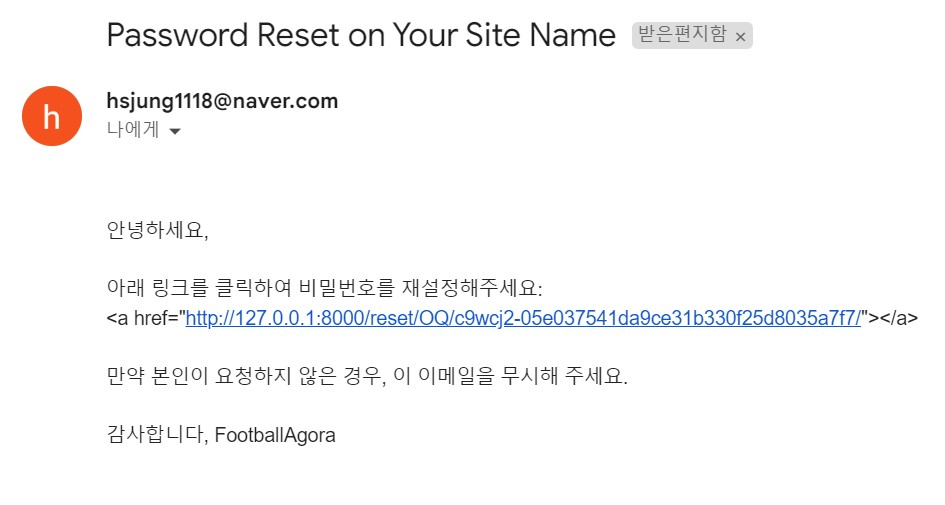

# ⚽ DA34-final-Football_Agora

## 🎉 Adios Team Final_Project (팀 프로젝트)

## 🎯 기획 목표
> - 자신만의 풋살 스토리를 직접 기록하며 공유할 수 있는 장을 마련해주는 서비스  
> - 남녀노소 구분없이 누구든지 풋살 문화에 쉽게 접근할 수 있도록 풋살 특화 생성형 AI 서비스 제공

## 1. 📅 제작 기간
- 2024년 5월 17일 ~ 7월 3일
- 팀 프로젝트
- 8명

## 2. 👥 R&R
- Django Framework로 혼자 웹 페이지 개발, DB 모델링, 모델 서빙

## 3. 🛠️ 사용 기술

### `Framework`
  - Django
### `Back-end`
  - MY SQL
  - FastApi
  - AWS RDS
### `Front-end`
  - HTML
  - CSS
  - JavaScript

## 4. 🧰 사용언어 및 라이브러리
- **언어**: Python, Javascript
- **개발 툴**: Pycharm
- **운영서버 라이브러리**: [Prod.txt](requirements/common.txt)
- **개발서버 라이브러리**: [Dev.txt](requirements/dev.txt)

## 5.
> 우리만의 풋살 스토리를 직접 기록하고 공유할 수 있는 장을 마련해주는 서비스    남녀노소 구분없이 누구든지 풋살 문화에 쉽게 접근할 수 있게 해주는 서비스

## 5. 🌐 서버 아키텍처

        
서버 아키텍처

        

## 6. 📑 ERD & 요구사항 정의서 & 화면설계서 & URL정의

        
ERD

        

[요구사항 정의서](요구사항정의서_최종.xlsx)

[화면설계서 PPT](FA_화면설계서_최종.pptx)

        
URL 정의

        
        
        

## 7. 💻 웹 서비스 기능
### 1. **기본적인 웹페이지 기능**: 
- **관련 앱 URL 정의**: [accounts앱](accounts/urls.py)
   1. 회원가입, 회원탈퇴, 로그인/로그아웃, 아이디/비밀번호 찾기, 비밀번호 초기화(이메일 인증) 후 변경
      

        
예시 화면

        
        
        
      

       
   2. 메인화면, 마이페이지
      

        
예시 화면

        
        
      

       
### 2. **풋살 매칭 플랫폼 마련**:
- **관련 앱 URL 정의**: [team앱](team/urls.py)
  1. 팀 생성/가입/탈퇴/수정
     

       
예시 화면

       
       
       
     

      
  2. 팀매칭(Team Match): 팀매칭을 위한 경기생성/참여
     

       
예시 화면

       
       
     

      
  3. 팀페이지(My Team): 팀 순위, 팀 경기일정
     

       
예시 화면

       
     

      
  4. 팀 경기 결과 작성: 경기리포트 작성/수정/삭제
     

       
예시 화면

       
     

      
  5. 매칭멤버 구하기: 팀 게시판 CRUD
     

       
예시 화면

       
     

      
  6. 팀스토리(Team Story): FA 전체팀들의 순위, 경기일정
     

       
예시 화면

       
     

      
### 3. 🤖 **Chatbot을 이용한 풋살에 관한 접근성 향상**
- **관련 앱 URL 정의**: [chatbot앱](chatbot/urls.py)
  - FastApi를 이용한 모델 서빙 [모델서빙](chatbot/views.py)
     

       
예시 화면

       
     

### 4. 🎥 경기 리포트에 올린 경기 동영상을 기반한 영상분석
   - 장고내에 영상분석 모델 내장
     

        
예시 화면

        
     

    
## 8. 📂 산출물 
- 🎬 시연영상: [시연영상 링크](웹페이지_시연영상.mp4)
- 📄 팀 포트폴리오: [팀 포트폴리오](FA_최종_ver_2.0.pdf)

## 9. 🛠️ 트러블 슈팅:
1. **Nginx로 웹에 배포할 때 static 파일들이 보이지 않는 현상**
   - [블로그 참조 링크](https://velog.io/@odh0112/Django-Static-file-Nginx%EB%A1%9C-%EC%B2%98%EB%A6%AC)
   - `settings` 디렉토리의 `base.py`(개발, 운영용 서버 공통 `settings.py`)에서 `STATIC_ROOT`, `STATIC_URL`, `STATICFILES_DIRS`, `MEDIA_ROOT`, `MEDIA_URL`을 재설정
   - `python manage.py collectstatic`을 통해 Static 파일들 모으기

2. **RDS(MySQL)와 Django 프로젝트를 연결한 뒤 RDS에서 생성한 여러 DB를 끌고 오려고 했으나 하나의 DB만 가져오는 현상**
   - [블로그 참조 링크](https://uiandwe.tistory.com/1252)
   - `base.py`의 DATABASE 딕셔너리에 각각의 스키마를 지정 후 `router.py`로 어떤 DB를 바라볼지 지정해주었지만, 프로젝트를 진행하면서 DB의 테이블을 수정하는 일이 빈번하게 발생해 하나의 DB에 모든 테이블을 모았습니다.

3. **비디오 모델을 더 좋은 성능을 내기 위해 GPU가 있는 서버에 올려, FastApi로 서빙하려고 했으나, 비디오 모델 용량이 300MB 정도 되어 Django 프로젝트 폴더 내에 video_analysis 폴더에 내장시켰습니다. 하지만 이미지 파일을 불러오는 부분에서 에러가 계속 발생했습니다.**
   - Django 프레임워크가 자동으로 이미지를 `media`라는 폴더에 저장시키는 줄 알았으나, 알고 보니 착각이었습니다. `media`에 저장되는 원리는 내가 직접 DB 필드에서 image 필드로 지정해줘야 저장이 되는 원리였습니다. 그래서 `media`로 경로를 설정하지 않고 저장되는 폴더의 경로를 지정했더니 해결되었습니다.

    
## 10. 🎯 중점 사항
- 화면설계서에 따른 템플릿 제작 (bootstrap, css, html)
- Url주소값에 따른 페이지 제작, PK값 지정
- 요구사항 정의서, 화면설계서에 따른 화면 제작 및 각 페이지마다 권한 지정
- DB 모델링(ERD)에 맞춰서 models.py 수정
- 주석을 이용한 기능명세 작성
- WBS에 맞춰 업무 진행 [WBS](FA_WBS_최종.xlsx)

## 11. 📝 미흡 사항 및 추후 과제
- 장고에서 지원하는 채널을 통해 실시간 팀 채팅 구현
- 도커를 이용한 협업 및 모델 서빙
- 웹과 웹에서 api를 이용한 요청을 할때 cors-headers오류가 나는것 잡기
- 영상분석 파트에서 '자세히 알아보기' 기능을 추가해 사용자에게 자세한 영상분석을 제공하는 유료서비스 추가

---

💬 **회고**: 이번 프로젝트에서는 팀에서 사정상 혼자 웹 개발을 맡게 돼 api로 데이터를 주고 받으면서 웹페이지를 제작하지 못해 너무 아쉬웠다.
다음 개인 프로젝트에서는 꼭 api로 데이터를 전달해주는 FastApi를 이용해 웹개발 말고 앱개발을 해 볼 예정이다.
  
